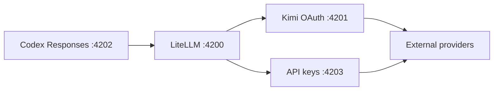

Codex sends the Responses API.
LiteLLM translates that contract to each provider's native protocol,
including OpenAI-compatible Chat Completions and Anthropic Messages, with
streaming and tool-call shapes preserved. Every listener binds to `127.0.0.1`.

The router authenticates the caller before reading model traffic and
passes only a random internal key to LiteLLM. The final forwarder discards
that key and injects only the selected provider credential. Browser-originated
requests are rejected, secrets are never exposed by public health routes, and
network-facing errors are sanitized.

Codex still owns the agent loop, tools, permissions, files, plugins,
skills, MCP servers, and conversation state. The router handles model inference
and protocol translation; it cannot add a capability the selected model or
provider does not implement.
